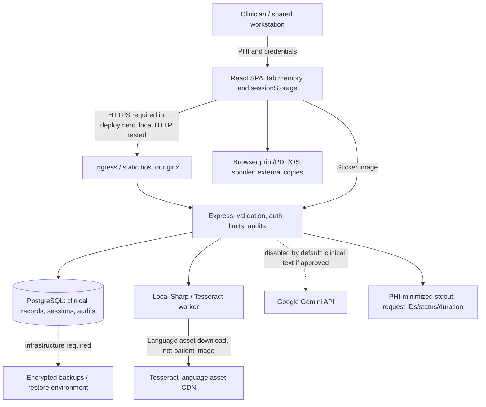

# Application Quality, Security and Production Readiness Audit

Assessment date: **2026-09-20**. Scope: the local repository, isolated synthetic PostgreSQL databases, local browser sessions and locally built containers. No production system, actual patient record, cloud credential or real PHI was used. The local ignored Gemini credential was inventoried by key name only; it was not printed, used or rotated.

## Current final disposition — 2026-09-20 local / 2026-09-21 UTC

**SECURITY GATE FAIL — OWNER ACTION REQUIRED.** Pinned Gitleaks 8.30.1 all-ref,
fully redacted, network-isolated scanning logged **51 commits / eight findings /
exit 1**. Two locations contain one historical Google-key-shaped value; six contain
truncated JWT documentation examples. Credential validity/revocation **UNVERIFIED**.
K's independent artifact-scoped triage PASS is **not secret-gate PASS**. The 51 scanned
versus 53 reachable count is unreconciled, not proof of missing commits. Authorized
owner review/containment, repository remediation and a reviewed full-history rescan
remain required; no key testing, rotation, history rewrite or ignores were performed.
See [sanitized triage](docs/verification/history-secret-findings.md).

**Local engineering verification passed; production/ePHI authorization remains
blocked.** [FINAL_VERIFICATION.md](docs/verification/FINAL_VERIFICATION.md) records
the actual parent-owned matrix, safe evidence hashes, failure chronology, image/SBOM
results and limits. The [A–L ledger](docs/verification/IMPLEMENTATION_STATUS.md)
supersedes the prior I supplement's pending statuses. Implementer environments could
not spawn nested evaluator tools: MAIN assigned **distinct dedicated read-only/testing
evaluators for each track** and returned failed work for correction before acceptance.
No implementer self-PASS is presented as independent; MAIN's separate documentation
cross-check remains pending.

| Current observed evidence | Result / qualification |
| --- | --- |
| MAIN full local release matrix, Node22 | PG17/UTC and corrected PG15/New_York: **17 contracts / 47 backend units / 642 frontend / 936 integration / 8 E2E**. Corrected PG15/UTC and final PG17/New_York: **23 / 47 / 644 / 936 / 8**. |
| Latest full run | **1,658 test cases**, not a sum of repeated/overlapping runs. Every full pass includes strict types, lint, build, npm audit **0** and **11 integration suites / 936 passed / zero skipped/todo**. |
| Independent acceptance | A/I PASS; B3 PASS (later date-query451 + lifecycle12 green in MAIN runs); C3 PASS; E2 **31** PASS; G3 **362 + 29** PASS; J **8** PASS; L **23 source + 9 explicit**, two overlaps, PASS. H structure and K triage only. |
| D/F qualification | **PASS WITH HISTORICAL FLAKE**; older backend HTTP timeout/400 causes UNKNOWN. Later D frontend failure was a separate test-only async WebCrypto settlement/invalid pagination-fixture issue, corrected to D18/full644; old failures retained. |
| Browser proof | MAIN independent recapture **8/8**, zero unexpected console/HTTP/external/page errors, unchanged schema catalog/120 protected files, eight valid PNG hashes. [Conflict](docs/verification/screenshots/04-conflict-review.png), [MOCKED AI](docs/verification/screenshots/05-ai-mocked-review.png), [history](docs/verification/screenshots/06-history-load-more.png); [manifest](docs/verification/browser-evidence.md). |
| Runtime image security | Baseline backend **11 HIGH/CRITICAL**, all global npm (not app npm audit). L removed unused global npm/Yarn/Corepack after production install; fresh independent and MAIN rebuild scans **0 HIGH/CRITICAL**, frontend **0**. Lower severities unscanned; Alpine3.24 EOL-list warning retained. |
| Local runtime/SBOM | MAIN direct-Node migration and production stack checks passed: health/ready/index/JS200, CSP/no-store, denied patient401/signup403, UIDs1000/101, graceful exit0/no OOM. CycloneDX1.7: backend **172**, frontend **71** components. No cloud/TLS/deployed-role claim. |

Implemented safeguards now include session-generation/expired-access logout safety;
unsaved draft, async identity, conflict and explicit AI review; durable transactional
retry keys with v3 actor+operation+key uniqueness; scope-bound directory/history
keyset paging and validated UI retries; read-only schema readiness, approved predeploy
migrations and measurement/collision preflight; minimized observability with restricted
resource references; strict required integration and deterministic nonroot images.
Inside the runtime image use the **compiled Node CLI, not removed npm**; repository
npm wrappers remain valid. See [operations](OPERATIONS.md#runtime-image-direct-node-commands).

**Q1–Q7 remain PENDING — NOT IMPLEMENTED; 42 policy specs NOT RUN.** Shared-clinic
access, browser-readable credentials, MFA/provisioning, durable pre-disclosure audit,
clinical version history/retention, legacy timestamp display/provenance (Q6 high-use
gate), vendors/contracts and actual infrastructure controls are not solved by tests.
Hosted CI, CodeQL and branch protection are still unverified. No live AI/real PHI,
production-ready or HIPAA-compliance claim follows from these local results.

### Historical audit snapshot below — preserved, not current counts

The original body beginning with “Executive Summary,” including its “current verified
results” of **33 backend + 10 frontend + 2 browser = 45**, describes the initial audit
snapshot only. Its bounded-history, startup, scanner and pending-feature descriptions
are superseded by this current summary, [API contracts](AUDIT_API_INVENTORY.md) and
[predeploy runbook](OPERATIONS.md#current-predeploy-cli-contract--2026-09-20). Prior
failures, synthetic restore/performance results and initial limitations are retained,
not erased or misrepresented as newly repeated measurements.

## Executive Summary

**Disposition: materially hardened and locally verified, but NOT established as production-ready for ePHI. This is not a HIPAA compliance certification.**

The application is a React 19/Vite TypeScript SPA, an Express 5/Node API and PostgreSQL. It manages a shared patient directory, per-doctor daily notes, vitals, appointments, visits, templates, clinician profiles and local analytics. Sharp/Tesseract process sticker images in API memory. An optional Google Gemini call can transmit clinical text off-platform. Authentication uses JWT bearer tokens and database sessions.

Baseline execution established that installation and backend compilation succeeded; frontend Vite bundling succeeded **despite 14 type errors**. Both test scripts were placeholders that failed. There was no lint, CI or test infrastructure. Dependency scanning reported **18 vulnerable packages: 1 critical, 11 high, 4 moderate, 2 low**, including development/transitive advisories; production-only scan reported 10. Advisory severity is not proof every issue was reachable in this application.

Runtime reproductions confirmed: any nonempty refresh string obtained an access token for an arbitrary active session; clinician B saw clinician A's private template; B changed A's appointment to an arbitrary status; idle sessions remained accepted; invalid note dates silently became today; and audit rows contained synthetic passwords and clinical text. Source review separately confirmed a public seed endpoint that could create/reactivate the known demo account and overwrite matching demo notes. **It did not wipe all patient tables**, and it was not invoked during baseline testing.

Repairs include exact-session signed tokens, one-time refresh rotation, logout and inactivity enforcement, disabled-account checks, production signup/seed gates, transactional clinical mutation audits, PHI-minimized telemetry, explicit API/CORS origins, bounded validation/uploads/rate limits, note revisions and conflict handling, safe dates, atomic patient creation, OCR parser/resource fixes, patient pagination, strict builds, non-root deterministic containers, and automated regression/release checks.

Current verified results: **33 backend tests, 10 frontend tests, 2 browser workflows passed**; strict type checks, lint, builds and both container builds passed. A local dependency scan reached zero advisories (rerun at release; this is time-dependent). Production-mode container startup, same-origin frontend proxying, disabled signup, non-root users, DB outage/readiness recovery and graceful shutdown were exercised. A synthetic dump/restore matched **60 tables / 60,562 rows**. The final bounded 10,000-patient / 50,000-note benchmark had 0/200 failed requests, ~557 requests/second and ~29 ms p95 on the audit host.

Highest remaining risks: shared-clinic access without explicit tenant/care-team boundaries; JavaScript-readable tab credentials; absence of MFA/recovery/admin enrollment; incomplete durable/tamper-resistant audit controls; unverified cloud TLS/storage/backup encryption and vendor contracts; unspecified clinical retention and incident procedures; no production restore evidence; process-local rate limits/OCR admission; bounded but incomplete history navigation; and legacy timestamp/revision limitations. Those are not resolved by successful tests.

### Architecture and trust boundaries

No Redis/cache, queue, scheduled worker, object storage, email/SMS, payment, error-monitoring SaaS, or third-party browser analytics SDK was found. `analytics_events` is a local PostgreSQL table. No infrastructure-as-code for a production environment or configured backup scheduler was found. SQL is parameterized; no user-directed network destination or shell execution exists in application request handlers.

## Evidence and Verification Matrix

Evidence is reproducible in [backend/tests/api.test.ts](backend/tests/api.test.ts), [backend/tests/security.test.ts](backend/tests/security.test.ts), [frontend/tests/workflows.test.tsx](frontend/tests/workflows.test.tsx), [tests/e2e/clinical.spec.ts](tests/e2e/clinical.spec.ts), [tests/performance.mjs](tests/performance.mjs), and [OPERATIONS.md](OPERATIONS.md). Test names describe assertions. No logs containing tokens or clinical payloads are committed.

| Area | Verified? | Result / limits | Evidence |
|---|---|---|---|
| Installation | Yes | Root `npm ci`; clean deterministic container installs. Root lockfile is authoritative. | Terminal runs; [package-lock.json](package-lock.json) |
| Build | Yes | Both apps and Node 22/nginx images build; errors no longer ignored. | `npm run build`; both Dockerfiles |
| Type checking | Yes | Strict backend and frontend pass; baseline frontend had 14 errors. | `npm run typecheck` |
| Lint | Yes, limited scope | Correctness/security rules pass, not a comprehensive style/type-aware security scanner. | [eslint.config.mjs](eslint.config.mjs) |
| Formatting | No configured tool | No formatter claim; not silently treated as passed. | Manifest inspection |
| Unit/component tests | Yes | 12 backend security units and 10 frontend units/components. | Test files above |
| Integration / database / API | Yes, synthetic | 21 integration cases, fresh PostgreSQL schema per run; real SQL and transactions. Skipped if `TEST_DATABASE_URL` absent. | API suite; guard rejects non-loopback/non-audit DB |
| E2E | Yes, local Chrome | Registration, patient creation, note/vitals/appointment/visit writes, reload persistence, logout, invalid login. No real camera hardware or deployed origin. | 2 Playwright workflows |
| Authentication | Yes | Arbitrary/incorrect/replayed tokens rejected; exact-session logout/idle expiry, inactive account rejection, login verified. | API/security suites; container production signup 403 |
| Authorization / PHI | Partial | Private templates and assigned appointments isolated; unauthenticated resource families denied; shared patient access explicitly reproduced and remains. | API suite (including shared-clinic test) |
| Audit logging | Partial | Mutations and success audit roll back together; successful login/search attribution and payload exclusion tested. Read audits asynchronous; immutable retention not proven. | Audit rollback and redaction tests |
| Encryption | Infrastructure unverified | HTTPS external endpoint in source; production origin checks. Local tests intentionally used HTTP/plain local PostgreSQL. No cloud TLS, disk or backup encryption attestation. | Config/source review |
| Security / dependencies | Partial | Safe negative requests, headers, CORS, rate limits, spoofed upload and session tests pass; npm advisory scan zero after fixes. No penetration-test certification or full DAST. | Suites, `npm audit`, structured secret scan |
| Frontend | Partial | Significant clinical workflow + stale-note and load-failure paths verified; all screens visually inspected only to code extent, not exhaustive browser/device/accessibility coverage. | Browser/component suites |
| Critical workflows | Yes, selected | Writes persisted across reload; matching DB rows/constraints checked. Provider AI success deliberately not invoked. | API/browser suites |
| Performance / scalability | Measured, bounded | 200 requests at concurrency 10 over synthetic 10k/50k dataset; no prolonged saturation or multi-replica test. | Performance section |
| Reliability | Partial | Readiness 503 during synthetic DB stop, liveness 200, recovery 200, graceful container exit 0; audited rollback and note races. | Controlled local outage and suite |
| Backups / recovery | Synthetic only | Streamed dump/restore into a different DB, all table checksums matched. Production backup policy, RPO/RTO/encryption remain unknown. | 60 tables/60,562 rows/0 mismatches |
| Documentation | Updated authoritative guides | Corrected Render/setup/contracts; historical guides retained and superseded, not all historical claims rewritten. | [OPERATIONS.md](OPERATIONS.md), [RENDER_DEPLOYMENT.md](RENDER_DEPLOYMENT.md) |
| CI/CD | Added, not remotely run | Workflow includes strict types, lint, unit/integration/E2E, audit, structured secret check, container builds. No claim of a successful GitHub-hosted run. | [.github/workflows/verify.yml](.github/workflows/verify.yml) |

### Baseline reproductions (before repair)

Using two synthetic accounts and a local disposable database:

| Reproduction | Observed before | Observed after |
|---|---|---|
| POST refresh with `not-a-token` | HTTP 200, token issued | 401 |
| B lists A's private template | Private text returned | Not returned |
| B updates A's appointment | 200, arbitrary status stored | 404; invalid status 400 |
| Session `last_activity` one hour old | Profile 200 | 401, refresh 401 |
| Note date `not-a-date` | 200, note saved as today | 400, no write |
| Inspect audit details for synthetic password/note | 3 matching rows | New suite excludes passwords/tokens/notes/OCR text |
| Compile frontend with tsc | 14 errors | 0 |
| Synthetic sticker labelled `MRN:` | OCR text present, expected identifier not parsed | Expected MRN parsed; real pipeline ~509 ms |

Historical audit rows were **not deleted**. An operator must assess prior real deployments for exposure and preservation/retention obligations.

## Security Assessment

The complete method/path/access/request/response/side-effect inventory is in [AUDIT_API_INVENTORY.md](AUDIT_API_INVENTORY.md).

### Authentication and session security

Passwords use bcrypt cost 12; registration requires at least 12 characters and rejects more than 72 UTF-8 bytes (avoids silent bcrypt truncation). Login remains compatible with shorter existing passwords. JWT verification restricts HS256, issuer, audience, token purpose and payload shape; every request checks the exact active DB session and current enabled account. Refresh hashes use SHA-256 over high-entropy signed tokens, not bcrypt (whose 72-byte limit is unsuitable for long JWTs). Atomic compare-and-rotate allows one winner under concurrent replay. Refresh is never accepted based merely on existence of any session. Role is read from the database on authenticated requests. Roles cannot be chosen at registration.

Access expires after 15 minutes; refresh/session lifetime is at most 7 days and subject to configurable inactivity. Logout revokes one session. Legacy tokens are invalidated by the new session/purpose/issuer requirements. Frontend stores access and refresh credentials in **sessionStorage (and access token in memory)**, not HttpOnly cookies. This reduces persistence but does **not** prevent XSS token theft. No verified XSS exploit was found; React renders clinical strings as text and no raw-HTML sink was found. An HttpOnly-cookie/BFF design requires explicit CSRF and same-site/cross-site deployment decisions. Current bearer headers are not ambient cookies; lack of CSRF tokens alone is **not** evidence of a current CSRF exploit.

MFA, password reset, account recovery, SSO, administrator enrollment, workforce offboarding UI and permission-management workflows are absent. Production signup defaults disabled, but an approved provisioning mechanism remains required. A stolen live bearer remains usable until expiration/revocation; the repository cannot establish device/workstation security.

### Authorization and PHI access matrix

| Resource | Read/search | Create | Modify | Delete/export/admin |
|---|---|---|---|---|
| Patients / demographics | All authenticated clinicians, shared directory | Authenticated clinician | Any authenticated clinician; activate/deactivate is not deletion | No patient DELETE API; browser can print data; DB administrators have wider access |
| Daily note | Current-day/specific-date endpoint: own doctor; history: shared clinic | Clinician, attributed to authenticated doctor | Own doctor/day only, revision-checked | No delete endpoint; previous edited text not versioned |
| Vitals | Shared clinic | Authenticated clinician, attributed | No update endpoint | No delete API |
| Appointments | Upcoming: own; patient history: shared | Authenticated doctor | Status: assigned doctor only | No delete API |
| Visits / patient trends | Shared patient history; doctor-today/dashboard scoped | Authenticated clinician | No visit-update endpoint | No delete API |
| Templates | Active public or own | Authenticated creator | No update/delete endpoints | Public template text must not contain PHI |
| Profile | Self | Registration subject to production gate | Self | No admin role API |
| Audit log / sessions | No ordinary-user API; DB/hosting operators | Application | DB role can currently alter logs | External immutability, retention and separation of duties required |

`created_by` is not silently interpreted as a care-team ownership rule. The original UI/history deliberately exposes a shared directory, so restricting it automatically could disrupt clinical access. This is **not tenant isolation** and must be resolved before deployments requiring narrower access. Tests affirm both isolated resources and the still-shared model.

### API, file, secret and dependency controls

- SQL values use placeholders. Validation bounds note/template text, dates, IDs, medical codes, JSON bodies, numeric vitals, status enums and pagination. Negative tests exercise malformed bodies, wrong types, invalid dates, oversized requests, invalid IDs and unauthenticated calls. Not every possible input permutation or route was fuzzed.
- JSON limit 128 KiB; sticker upload 8 MiB, one file/no extra fields; JPEG/PNG/WebP declared types plus actual decoder-format checks, 12-megapixel input cap and bounded output. SVG/malformed uploads rejected. No persistent uploaded filename/path or direct file URL is used.
- OCR admits one job/process, rejects busy work, and terminates timed-out workers; no distributed queue. A real synthetic OCR image was processed; successful OCR is not reliable patient identity proof. UI retains human review and warnings. No malware-scanning product or live camera/device test was performed.
- Global API limiter 600/minute/IP; auth 30/15 minutes/IP; OCR/AI 10/minute/IP. Limits are process-local and require trusted ingress configuration. One shared clinical NAT can hit the same limit; multiple replicas increase the effective allowance.
- Exact-origin CORS; Helmet; no `X-Powered-By`; no-store API responses; JSON errors; bounded DB connection/statement timeouts. nginx frontend adds CSP and disables raw URL access logging. Static cloud-site headers need separate platform configuration.
- Production secrets/defaults and HTTPS origins are validated at startup. Ignored [secrets.env](secrets.env) contains a Gemini-key variable (value not inspected in output). No matches in the working-tree structured secret patterns; secret filenames were absent from `git log --all` path history. **This is not proof of a clean full Git history** or proof that no secret was ever shared externally. No real credential was rotated.
- Dependency patch/minor fixes plus deliberate Sharp 0.35/Vite 6 changes were regression-tested. A temporary unintended TypeScript 7 selection was discovered by container compilation and corrected/deduplicated to tested TypeScript 6.0.2. Production runtime dependencies are separated from build/test tooling. Container OS packages were not scanned with Trivy/Grype; npm zero advisories does not cover OS/C-library/provider vulnerabilities.

### Lightweight threat model

Assets: patient/clinical data, credentials, session tokens, audit evidence, backups and availability. Actors: not-signed-in attacker, malicious/compromised clinician, privileged DB/host operator, compromised dependency/provider, stolen workstation. Boundaries: browser↔ingress↔API↔DB; API↔OCR worker/assets; API↔Gemini; DB↔backup; browser↔print/PDF.

Highest-risk paths: (1) arbitrary refresh→account impersonation (fixed); (2) public enrollment/demo seed→shared PHI (production defaults locked down, provisioning/model unresolved); (3) compromised legitimate clinician→all shared patient histories (remaining); (4) request-body logging→credential/PHI copies (new logging fixed, historical exposure needs incident review); (5) browser script compromise→tab tokens (remaining); (6) unapproved Gemini configuration→third-party clinical disclosure (default-off gate, contracts unresolved); (7) oversized image/expensive request→availability loss (bounded locally, distributed controls remain); (8) privileged DB access→audit alteration or clinical deletion (infrastructure/separation-of-duties gap).

## HIPAA-Oriented Technical Safeguard Assessment

This is an engineering assessment, **not legal advice, certification, or a finding of compliance**. A technical application alone cannot satisfy organizational, physical, infrastructure or contractual duties.

### Administrative Safeguards

**Requires organizational process:** documented risk analysis/management, workforce authorization/training, sanctions, onboarding/offboarding, role approval, minimum-necessary access policy, emergency access, incident response and breach assessment, change control, retention/legal hold, vendor management, backup ownership/RPO/RTO, periodic access/audit reviews and contingency exercises. None was established from repository documentation. Obtain qualified compliance/legal review of applicable requirements and agreements.

### Physical Safeguards

**Requires infrastructure/provider verification:** datacenter access, host isolation, device/media inventories, workstation/session controls, disk encryption, secure disposal, backup-media handling, removable media and print/PDF controls. No infrastructure console, attestation, cloud policy, device-management configuration or physical inspection was available.

### Technical Safeguards

| Control | Assessment / ownership |
|---|---|
| Unique identification | **Verified in application:** unique email/ID, password hash, attributed clinical writes, exact session binding. Shared demo users must not be production identities. |
| Access control | **Partly verified:** bearer/session checks, private templates, own-note revisions and appointment owner status. **Requires product/security design:** care-team/tenant/RBAC boundaries and privileged administration. |
| Emergency access | **Requires organizational process and implementation:** no break-glass path, approval, elevated audit or emergency policy. Do not improvise one in production. |
| Automatic logoff | **Verified server-side:** inactivity checked before activity update. **Frontend partial:** 15-minute UI interaction timer and 401 teardown; shared-device/OS behavior not verified. |
| Encryption/decryption | **Requires infrastructure:** DB/disks/backups encryption/key lifecycle not established. Password hashing is verified but is not clinical-record encryption. No application-level field encryption. Threat-model/key-management decision required. |
| Audit controls | **Partly verified:** metadata attribution, outcomes, request IDs; clinical mutation+audit atomic. **Requires infrastructure/process:** durable read events, append-only/tamper resistance, off-host retention, access reviews, alerts and incident search. |
| Integrity | **Verified selected controls:** FKs/uniqueness, date/type validation, transactional writes, optimistic note revisions and rollback. **Remaining:** amendment/version history, signatures/finalization, direct-DB constraints/privileges and consistent time-zone policy. |
| Authentication | **Verified selected controls:** password hashing, JWT purpose/signature, replay rotation, revocation and disabled-user checks. **Requires additional design:** MFA, approved enrollment/recovery/offboarding. |
| Transmission security | **Application defaults improved:** explicit origins, HTTPS external URL, no keys in query strings. **Requires deployment verification:** real ingress HTTPS/HSTS, DB TLS/certificates, private links and proxy trust. |
| Vendor controls | **Requires contractual/vendor verification:** exact cloud/database/logging/AI products and PHI permissions, BAAs where applicable, subprocessor/retention/training restrictions. Not verified. |

## PHI Data Flow and Lifecycle

| Stage / data | Residence, access and transmission | Logging, retention, deletion and external copies |
|---|---|---|
| Collection | Clinician browser: names, MRN/patient IDs, DOB, gender, phone/email, allergies, medications, conditions, emergency-contact schema fields, notes, diagnoses, treatment/follow-up, vitals, appointments/visits; sticker image/text. Credentials/provider profile also collected. | No insurance, billing, lab-result or document-storage workflow found. Free text can contain any PHI, including data not explicitly modeled. |
| Browser processing | React state, captured-image data URL/canvas; access/refresh tokens in tab sessionStorage. User/scripts/extensions/OS can access delivered data. | Legacy localStorage credentials cleared. No intentional browser clinical-data persistence/cache added; browser/OS caches and print spoolers remain deployment/device responsibilities. |
| API transmission | Intended HTTPS browser→API; local tests HTTP. API validates and authenticates; bearer headers rather than cookies. | No request bodies/auth headers/query strings in application telemetry; explicit patient resource IDs remain sensitive audit metadata. Provider/reverse-proxy logging must be checked separately. |
| OCR | Image decoded/transformed and recognized locally in process/worker memory; no uploaded file persistence or public URL. | Tesseract may download English language assets from its CDN; patient image is not uploaded by this code. Asset provenance/pinning and container offline readiness require further review. |
| Storage | PostgreSQL users/patients/clinical_notes/vital_signs/appointments/visit_history/note_templates/data_retention/analytics_events/audit_log/sessions. Application and DB administrators can access. | DB storage/backup encryption not established. Raw clinical fields are not application-encrypted. bcrypt passwords and SHA-256 refresh-token hashes; audit IDs/IPs/user agents are still sensitive. |
| Optional AI | Entire note text sent via HTTPS to Google's Gemini endpoint if both approval flag and backend key are configured. | Default off; no live provider call made. Vendor identity/product eligibility, BAA, training/retention, regions and subprocessors **unverified**. Prompt instructions cannot guarantee clinical correctness or eliminate disclosure. |
| Logging | DB audit contains actor, route/action, allowed resource reference, time, IP, outcome/status, correlation ID; stdout has generic events, status and duration. | Prior version stored whole bodies, including credentials/PHI. Historical copies/backups not purged. Read-event delivery is best effort. No approved retention/immutable sink. |
| Backup | Synthetic dump stream restored locally to a distinct DB; no exported dump file committed. | Production frequency, encryption, access, geographic copies, retention, integrity checks and restore scheduling unknown. |
| Export | Browser print/PDF function; ordinary users can also copy data delivered to them. | No server-authorized, durably audited export workflow. OS/PDF/printer retention and authorized disclosure controls required. |
| Retention / deletion | `is_active` hides/marks status, not erasure. No patient DELETE HTTP route. Retention table has no executing scheduler; new default disables automatic deletion. | Existing retention rows unchanged. FKs include cascading clinical deletion if privileged DB deletes a patient. Clinical retention/legal holds and secure disposal undefined; no automatic data purge added. |

### Third-party inventory

- **Hosting/static/CDN/database provider (Render in documentation; nginx local):** can process PHI in transit, storage and service logs; exact deployment/agreements/retention inaccessible.
- **Google Gemini:** receives raw clinical text only when enabled; HTTPS and header-key transport verified in code; no BAA, training/retention policy or live response verified. Leave disabled pending approval.
- **Tesseract language-asset CDN:** receives asset requests/host network metadata, not sticker image content in this implementation. Pin/vendor assets and review decoder supply chain before offline or regulated deployment.
- **npm/container registries and CI:** receive dependency/image requests, not patient records in tests. CI uses synthetic data, and browser screenshots/traces/video are off. Protect any future artifacts/logs; no general PHI artifact upload is configured.
- No email, SMS, payment, external analytics or APM data recipient was identified. Future integrations require a new data-flow/vendor assessment.

## Scalability Assessment

The API is otherwise stateless across replicas because sessions live in PostgreSQL, but rate-limit counters and OCR admission are local memory. Sessions are checked/updated on each request; this favors immediate revocation but increases DB writes. Do not casually replace it with stale caching that weakens revocation.

Patient directory results are bounded and UI-paginated (default 50, max 100; offset capped 100000). Patient code aggregation remains per returned patient and may be expensive for unusually large histories; indexed access is used, but no claim of constant cost. Other histories use bounded recent windows (10/20/30/50/100) and lack complete archival pagination/UI navigation. Offset pagination can become expensive or shift during concurrent inserts; keyset pagination is a follow-up.

Composite patient/date, doctor/date and directory-order indexes were added. Measured note-history plans used an index; five dashboard queries remain sequential. Audit/session tables grow without approved archival/cleanup; direct DB runtime role still needs separation from schema migration privileges. Pool default is 10 per replica; bound aggregate connections. DB statement/connection timeouts prevent indefinite waits but are not capacity planning.

OCR is synchronous request work with one admitted worker per process, a 25-second deadline and pixel/byte limits. Large concurrent scans return busy/rate-limit responses rather than queueing. A durable queue with isolated resource-limited workers, job auth, bounded retention and approved offline assets is needed for larger workloads. External AI has a 20-second timeout and no automatic PHI-bearing retry. There is no distributed job system or scheduler to duplicate today.

Expected growth failure points: DB write/audit contention, connection budget exhaustion, cumulative code payloads, history-window truncation, per-process rate-limit bypass, OCR CPU/memory pressure, and large index/DDL locks during startup migration. No production QPS/SLO target or multi-instance stress test was provided; horizontal scaling is **not proven**.

## Performance Assessment

Local host: macOS 13.5 ARM64, Node 20.20.0 tests, Docker PostgreSQL 17; deployment images build/use Node 22. Data and credentials synthetic; loopback networking, warm local caches. See guarded benchmark script. These are smoke measurements, not a sizing guarantee.

| Measurement | Observed |
|---|---|
| Dataset | 10,000 patients, 50,000 notes; five notes/patient |
| Workload | 200 authenticated directory requests, page size 50, concurrency 10 |
| Failures | 0 |
| Latency (final rerun) | p50 15.69 ms; p95 28.72 ms; max 62.99 ms |
| Throughput (final rerun) | 557.22 requests/second during this short run |
| API process RSS (final rerun) | 129.34 MiB (excludes DB/container/browser memory) |
| CPU delta (final rerun) | user 434.15 ms; system 24.87 ms for the measured run |
| Note lookup plan (first measurement) | Bitmap index scan `idx_notes_patient_date`; five matching rows; total execution 0.783 ms; planning 0.665 ms |
| Real synthetic OCR after parser fix | 509 ms, expected MRN recognized; one clean generated image, not a clinical accuracy study |
| Frontend production bundle | ~331.9 kB JavaScript / ~99.0 kB gzip in measured build |

Not measured: sustained leak/soak behavior, slow external network, many replicas, cold-start SLO, production query plans/data skew, large single-patient histories, object-storage throughput (not present), clinical OCR accuracy, cloud CPU/cost limits or AI latency/quality. Concurrent note writers were functionally tested (one success/one conflict), not load-tested at hospital-scale write volume.

The earlier identical smoke workload measured 492.92 requests/second and 36.38 ms p95. Variation between short local runs is expected; neither measurement establishes a production SLO.

## Reliability Assessment

- `/health` reports process liveness; `/ready` actually queries PostgreSQL. Stopping only the synthetic DB returned health **200 (~37 ms)** and readiness **503 (~58 ms)**; restarting it restored readiness **200** without restarting the API.
- Container SIGTERM drained and exited **0**, `OOMKilled=false`; startup validates production secrets/origins/seed state before listening. Startup failure remains fail-fast; orchestration backoff/restart policy is external.
- Query connection timeout 5 s, statement timeout 15 s, pool idle 30 s; server request/header limits and shutdown deadline present. Arbitrary SQL writes are not automatically retried after ambiguous network failure.
- Clinical mutation audit failure rolled back the patient insert in a real PostgreSQL transaction. Concurrent duplicate patient create produced 201/409; concurrent note revisions produced 200/409 instead of silent lost update. Appointments/visits still have no durable idempotency key; UI submit disabling does not solve ambiguous network retry duplicates.
- Initial schema DDL and additive migrations are transactional/advisory-locked. Migration reruns preserved synthetic users and one migration ledger entry. Existing real production clones, large-table lock durations and data-shape drift were not verified. Deployment should still use a controlled migration stage, not unrestricted DDL credentials in every API replica.
- Synthetic dump/restore: 60 tables/60,562 rows, zero row-count/checksum differences in a separate database. This is **not** proof of scheduled encrypted off-host backups, production restorability, failover or RPO/RTO.
- Logs contain request IDs, generic event/status/duration; operators still lack configured metrics retention, tracing, durable alert routing, centralized audit search and tested incident runbooks. Read audits run after response and can be lost on process crash or DB failure; mutation audits are stronger.

## Findings

Status **Confirmed** means runtime or directly demonstrated source/config evidence; **Unable to Verify** is not a pass. “Fixed” describes repository changes, not proof that any deployment received them. Findings intentionally avoid treating all warnings as critical.

### CRITICAL

#### F01 — Arbitrary refresh authentication bypass
- **ID / Severity / Category:** F01 / CRITICAL / Authentication.
- **Status:** Confirmed; fixed locally.
- **Location:** [backend/src/routes/auth.ts](backend/src/routes/auth.ts), [backend/src/utils/auth.ts](backend/src/utils/auth.ts).
- **Description / Expected / Actual:** Refresh must prove possession of a valid token for its exact session; baseline ignored it and selected the first active user session.
- **Evidence / Reproduction:** Two synthetic accounts; POST refresh with `not-a-token` returned 200 with an access token.
- **Root Cause:** No signature/hash/session validation at refresh.
- **Security Impact:** Unauthenticated impersonation. **PHI Impact:** Shared records exposed. **Scalability Impact:** None primary. **Reliability Impact:** Session trust invalid. **Data Integrity Impact:** Impersonated writes possible.
- **Recommended Fix / Fix Applied:** Signed purpose-bound JWTs, UUID session binding, full-token hash comparison and atomic rotation/replay rejection; production secret validation.
- **Files Changed:** Auth routes/utilities/middleware, session service, config and migration files.
- **Verification After Fix / Regression Test:** Arbitrary token 401; concurrent refresh one 200/one 401; wrong-purpose/tampered JWT rejected in API/security suites.

### HIGH

#### F02 — Public demo seeding and uncontrolled clinician enrollment
- **ID / Severity / Category:** F02 / HIGH / Administrative access and data integrity.
- **Status:** Confirmed source; fixed gates, enrollment workflow unresolved.
- **Location:** [backend/src/db/seed.ts](backend/src/db/seed.ts), [backend/src/index.ts](backend/src/index.ts), [backend/src/app.ts](backend/src/app.ts).
- **Description / Expected / Actual:** An unauthenticated public seed route should not alter clinical deployments; baseline could create/reactivate a documented demo doctor, reactivate sample patients, and overwrite matching sample notes. Signup also granted doctor access without approval.
- **Evidence / Reproduction:** Former public route and seed SQL inspected; not invoked. Baseline synthetic registration returned 201.
- **Root Cause:** Demo/production boundary absent.
- **Security Impact:** Known-account/shared-access risk. **PHI Impact:** Existing records could become accessible. **Scalability Impact:** Repeat inserts. **Reliability Impact:** Polluted data. **Data Integrity Impact:** Matching demo notes overwritten; no evidence of wholesale table wiping.
- **Recommended Fix / Fix Applied:** Removed HTTP route; production seed rejected; production signup off by default, separate approval required.
- **Files Changed:** App/bootstrap/config/seed, Compose and guides.
- **Verification After Fix / Regression Test:** Seed 404; production container signup 403; API suite. No admin enrollment UI implemented.

#### F03 — Credentials and clinical payloads duplicated into logs
- **ID / Severity / Category:** F03 / HIGH / Privacy and secrets.
- **Status:** Confirmed; new logging fixed; historical exposure review required.
- **Location:** [backend/src/middleware/auditLog.ts](backend/src/middleware/auditLog.ts), [frontend/src/context/AuthContext.tsx](frontend/src/context/AuthContext.tsx).
- **Description / Expected / Actual:** Audit should record accountability metadata; baseline copied whole request bodies and frontend Axios configuration/errors.
- **Evidence / Reproduction:** Three synthetic audit rows matched password/note markers. Frontend Axios config contains credentials/authorization context.
- **Root Cause:** Unrestricted body/error serialization.
- **Security Impact:** Credential/token disclosure. **PHI Impact:** Extra clinical copies. **Scalability Impact:** Large audit payload growth. **Reliability Impact:** Harder safe diagnostics. **Data Integrity Impact:** None primary.
- **Recommended Fix / Fix Applied:** Allowlisted metadata/outcomes/correlation IDs, generic logs, no raw proxy URL access logs; clinical-write audit atomicity.
- **Files Changed:** Audit/write service, routes, frontend diagnostic call sites and nginx config.
- **Verification After Fix / Regression Test:** API suite asserts absence of synthetic password/token/note/OCR values and presence of actor/search attribution. Old rows/backups were not purged.

#### F04 — Private templates and appointment status crossed user boundaries
- **ID / Severity / Category:** F04 / HIGH / Object authorization.
- **Status:** Confirmed; fixed.
- **Location:** [backend/src/routes/templates.ts](backend/src/routes/templates.ts), [backend/src/routes/appointments.ts](backend/src/routes/appointments.ts).
- **Description / Expected / Actual:** Private active templates belong to their creator; appointment status belongs to assigned doctor. Baseline list used `OR is_active`, and status update lacked doctor filtering.
- **Evidence / Reproduction:** Synthetic B saw A's private text and changed A's appointment, both 200.
- **Root Cause:** Wrong Boolean predicate / missing owner predicate.
- **Security Impact:** Cross-user access. **PHI Impact:** Template text may contain clinical data. **Scalability Impact:** Excess results. **Reliability Impact:** Appointment state tampering. **Data Integrity Impact:** Unauthorized modifications.
- **Recommended Fix / Fix Applied:** `(public OR creator) AND active`; status enum and `doctor_id` in update WHERE.
- **Files Changed:** Template/appointment routes and validation.
- **Verification After Fix / Regression Test:** Other-user template absent, appointment update 404, invalid status 400; API suite.

#### F05 — Idle/revoked/disabled sessions were not enforced correctly
- **ID / Severity / Category:** F05 / HIGH / Sessions.
- **Status:** Confirmed; fixed server paths.
- **Location:** [backend/src/middleware/auth.ts](backend/src/middleware/auth.ts), [frontend/src/utils/apiClient.ts](frontend/src/utils/apiClient.ts).
- **Description / Expected / Actual:** Exact session must expire/revoke; baseline timeout ran before authentication and every request updated all a user's sessions. No server logout endpoint existed.
- **Evidence / Reproduction:** Synthetic session one hour idle still returned profile 200.
- **Root Cause:** Middleware ordering, user-wide session selection/activity, absent logout revocation.
- **Security Impact:** Extended/stale access. **PHI Impact:** Shared workstation exposure. **Scalability Impact:** Excess session updates. **Reliability Impact:** Misleading client auth state. **Data Integrity Impact:** Stale credential writes.
- **Recommended Fix / Fix Applied:** Atomic exact-session activity predicate, active-user join, revoking logout, browser refresh/401 teardown and inactivity timer.
- **Files Changed:** Middleware/auth routes, frontend auth/client, session/migration helpers.
- **Verification After Fix / Regression Test:** Idle/disabled/revoked 401, other session unaffected, browser logout and reload tested. Offline revocation cannot be guaranteed.

#### F06 — Silent note-date substitution, race and partial clinical writes
- **ID / Severity / Category:** F06 / HIGH / Clinical integrity.
- **Status:** Confirmed; selected defects fixed; full amendment history remains absent.
- **Location:** [backend/src/routes/notes.ts](backend/src/routes/notes.ts), [backend/src/services/auditedWrite.ts](backend/src/services/auditedWrite.ts), [frontend/src/components/PatientForm.tsx](frontend/src/components/PatientForm.tsx).
- **Description / Expected / Actual:** Reject invalid dates, detect concurrent edits and commit complete clinical changes with audit. Baseline converted invalid dates to today, used select-then-write note updates, wrote clinical data before a separately fallible audit, and created patient demographics in three API calls.
- **Evidence / Reproduction:** Invalid date returned 200; multi-step code paths inspected. New tests explicitly race writers and force audit failure.
- **Root Cause:** Permissive date fallback and non-atomic operations.
- **Security Impact:** Attribution gaps. **PHI Impact:** Wrong encounter context. **Scalability Impact:** Extra requests/races. **Reliability Impact:** Partial writes/duplicate retries. **Data Integrity Impact:** Overwritten or misplaced clinical facts.
- **Recommended Fix / Fix Applied:** Strict dates, calendar DATE parser, revision-checked atomic upsert, audited transactions and one-call complete patient create.
- **Files Changed:** Notes/patients/vitals/visits/appointments, write helper/migration, frontend form/editor.
- **Verification After Fix / Regression Test:** Invalid date 400, note race 200/409, duplicate patient 201/409, forced-audit failure leaves no patient; DOB/persistence tests pass.

#### F07 — Build/deployment accepted unverified or broken artifacts
- **ID / Severity / Category:** F07 / HIGH / Release reliability.
- **Status:** Confirmed; fixed local builds.
- **Location:** [backend/Dockerfile](backend/Dockerfile), [frontend/Dockerfile](frontend/Dockerfile), [frontend/package.json](frontend/package.json).
- **Description / Expected / Actual:** Release must compile and start reproducibly. Baseline frontend skipped type checks, backend image used `tsc || true`, frontend Dockerfile contained a stray instruction, runtime used unpinned on-demand serving, and health checks depended on unavailable curl.
- **Evidence / Reproduction:** Frontend tsc reported 14 errors while Vite succeeded; Docker/config source inspected.
- **Root Cause:** Build bypasses, divergent locks and dev-oriented deployment.
- **Security Impact:** Unsupported runtime/supply-chain risk. **PHI Impact:** Insecure deployment defaults. **Scalability Impact:** Inconsistent instances. **Reliability Impact:** Deployment failure. **Data Integrity Impact:** None direct.
- **Recommended Fix / Fix Applied:** Root-lock `npm ci`, strict build gate, Node 22 non-root API, unprivileged nginx/static proxy, built-in probe clients, local-only Compose.
- **Files Changed:** Manifests/lockfiles/tsconfigs, Dockerfiles, nginx/Compose/ignore rules.
- **Verification After Fix / Regression Test:** Both image builds and runtime probes pass; UIDs 1000/101; production startup tested. CI added but hosted execution unverified.

#### F08 — Known dependency advisories
- **ID / Severity / Category:** F08 / HIGH overall / Supply chain (one baseline transitive advisory rated critical).
- **Status:** Confirmed scanner output; remediation locally verified.
- **Location:** Root and workspace package manifests/lockfile.
- **Description / Expected / Actual:** Baseline 18 vulnerable packages across runtime/build tools; 10 production-only. Reachability varies (e.g. browser use versus server framework modes).
- **Evidence / Reproduction:** `npm audit` summaries recorded above; no exploit of an advisory attempted.
- **Root Cause:** Outdated direct/transitive resolutions and nested lock drift.
- **Security Impact:** Advisory-dependent. **PHI Impact:** Potential compromise/availability loss. **Scalability Impact:** Possible DoS. **Reliability Impact:** Native/asset processing risk. **Data Integrity Impact:** Advisory-dependent, not proven.
- **Recommended Fix / Fix Applied:** Compatible fixes; targeted Sharp/Vite upgrades; separate dev dependencies; single authoritative lock and deduplicated tested compiler.
- **Files Changed:** Package manifests and root lock; removed stale nested backend lock.
- **Verification After Fix / Regression Test:** Zero npm advisories at check; builds, real image decode/OCR, API and browser tests pass. OS/C-library image scanning still required.

#### F09 — Shared PHI access model lacks clinic/tenant/care-team policy
- **ID / Severity / Category:** F09 / HIGH / Least privilege.
- **Status:** Confirmed; unresolved product/security decision (not a new regression).
- **Location:** Patient/history/trend routes and [backend/src/db/schema.ts](backend/src/db/schema.ts).
- **Description / Expected / Actual:** Authorized PHI audience must be explicit. Existing system grants authenticated clinicians shared patient lookup/edit/history access without organizations, assignments, consent or break-glass.
- **Evidence / Reproduction:** API regression deliberately confirms B can find A-created patient. Schema has `created_by` attribution, not a care-team model.
- **Root Cause:** Single shared-clinic architecture without finer-grained permission model.
- **Security Impact:** Broad insider/compromised-account reach. **PHI Impact:** All shared records. **Scalability Impact:** Blocks safe multi-tenant expansion. **Reliability Impact:** Arbitrary ownership patch could deny legitimate clinical access. **Data Integrity Impact:** Any clinician can edit shared demographics.
- **Recommended Fix:** Product/compliance-approved organization/care-team model, server-side policy enforcement everywhere, explicit emergency access and negative tests.
- **Fix Applied / Files Changed:** Production signup gate only; no invented owner migration or record reassignment.
- **Verification After Fix / Regression Test:** Shared-clinic exposure remains intentionally visible in tests. Not approved for tenant-isolated use.

#### F10 — Infrastructure, vendor and recovery safeguards not established
- **ID / Severity / Category:** F10 / HIGH deployment risk / Infrastructure and privacy.
- **Status:** Unable to Verify cloud/contractual controls; absence of repository configuration confirmed.
- **Location:** Deployment guides, [backend/src/app.ts](backend/src/app.ts), [OPERATIONS.md](OPERATIONS.md).
- **Description / Expected / Actual:** Real ePHI requires approved provider/transport/storage/backup/operational controls. No live cloud account, TLS attestation, BAA, production restore or retention policy was available. Gemini can receive raw notes when enabled.
- **Evidence / Reproduction:** Exact external HTTPS endpoint/source data flow inspected; no real provider call made. Only local synthetic restore tested.
- **Root Cause:** Infrastructure/organizational controls outside repository and missing approvals.
- **Security Impact:** Potential privileged/vendor exposure. **PHI Impact:** Clinical text/storage/backups. **Scalability Impact:** Unknown service quotas/availability. **Reliability Impact:** Unproven recovery. **Data Integrity Impact:** Unproven restore of real data; AI factual fidelity unknown.
- **Recommended Fix:** Verify actual cloud/DB TLS, keys, disk/backups, access, RPO/RTO, contracts and policies; approved vendor configuration and clinician review.
- **Fix Applied / Files Changed:** External AI default-off gate, key moved out of URL, timeout/generic errors; accurate deployment/runbook guidance.
- **Verification After Fix / Regression Test:** Disabled AI 503 without external call; synthetic restore matched. Organizational/legal safeguards remain unresolved.

### MEDIUM

#### F11 — Incomplete validation and unbounded expensive requests
- **ID / Severity / Category:** F11 / MEDIUM / API and availability.
- **Status:** Confirmed source and invalid-request behavior; improved, not exhaustive fuzzing.
- **Location:** [backend/src/middleware/validation.ts](backend/src/middleware/validation.ts), [backend/src/services/stickerOcr.ts](backend/src/services/stickerOcr.ts).
- **Description / Expected / Actual:** Requests must be typed/bounded; baseline accepted arbitrary status/limits and only bounded upload bytes, not decoded pixels/CPU, with no rate limits.
- **Evidence / Reproduction:** Arbitrary appointment status stored; malformed date saved; upload/query code reviewed.
- **Root Cause:** Scattered truthiness checks, no resource admission.
- **Security Impact:** Abuse/DoS. **PHI Impact:** Integrity/availability. **Scalability Impact:** CPU/memory/query amplification. **Reliability Impact:** 500s/resource exhaustion. **Data Integrity Impact:** Bad clinical types/date/status.
- **Recommended Fix / Fix Applied:** Central schemas, bounded bodies/queries/uploads, decoder format/pixel checks, OCR deadline/admission, IP limits and exact CORS.
- **Files Changed:** Validation/app/OCR/patients routes.
- **Verification After Fix / Regression Test:** 400/413/415/429 cases; actual decoder and OCR pass. Distributed admission and broader fuzzing remain.

#### F12 — Frontend stale data and API contract failures
- **ID / Severity / Category:** F12 / MEDIUM / Clinical UX/correctness.
- **Status:** Confirmed; selected workflows fixed.
- **Location:** NoteEditor, VitalsCard, TemplatesAnalyticsPanel, PatientForm, API client and auth context.
- **Description / Expected / Actual:** Selected patient/encounter must match shown/saved content. Baseline did not cancel stale note responses, swallowed note-load failures, used `vitals` instead of `vitalSigns`, guessed API hosts, and relied on a stored user blob.
- **Evidence / Reproduction:** Source mismatches; component tests reproduce delayed old-patient response and failed-load state. Baseline frontend had 14 type errors.
- **Root Cause:** Async lifecycle/contract drift and missing tests.
- **Security Impact:** Credentials could target guessed host. **PHI Impact:** Wrong-patient display. **Scalability Impact:** Extra frontend requests. **Reliability Impact:** Empty histories/misleading auth. **Data Integrity Impact:** Wrong-note overwrite risk.
- **Recommended Fix / Fix Applied:** Generation-guarded note loading, disabled editing on load failure, key-scoped patient view, explicit API origin, corrected vitals/ID/date types, history refresh, server-validated restored auth.
- **Files Changed:** Frontend components/pages/client/context/tsconfig and tests.
- **Verification After Fix / Regression Test:** Component races/conflicts/contracts and 2 real-browser workflows pass. Other screens/devices not exhaustively tested.

#### F13 — OCR identifier and unmatched-patient audit failures
- **ID / Severity / Category:** F13 / MEDIUM / Patient identification.
- **Status:** Confirmed; fixed tested cases; OCR remains advisory.
- **Location:** Sticker parser/OCR and patient scan route.
- **Description / Expected / Actual:** Common MRN label should parse; unknown scan must not insert a nonexistent FK or duplicate raw PHI into audit. Baseline recognized `M#` but not `MRN:` and audited guessed IDs/parsed text directly.
- **Evidence / Reproduction:** Real generated sticker produced text but failed identifier match; FK path established in SQL/schema.
- **Root Cause:** Narrow regex and audit referencing unpersisted patient.
- **Security Impact:** PHI logging. **PHI Impact:** Patient mismatch risk. **Scalability Impact:** Extra OCR retries. **Reliability Impact:** Unknown scan could 500. **Data Integrity Impact:** Potential incorrect patient identification.
- **Recommended Fix / Fix Applied:** Word-bounded MRN/M labels, invalid DOB rejection, nullable matched FK and warning-count metadata, bounded OCR work.
- **Files Changed:** Parser/OCR/patient route and security/API tests.
- **Verification After Fix / Regression Test:** Real synthetic MRN recognized; unknown-ID branch 200 with mocked recognizer; malformed images rejected. No clinical accuracy certification.

#### F14 — Audit durability, browser credentials and export controls remain incomplete
- **ID / Severity / Category:** F14 / MEDIUM / Privacy and auditability.
- **Status:** Confirmed architectural gaps; no XSS or audit-tampering exploit claimed.
- **Location:** Audit middleware, API client/auth context, template analytics print control, DB privileges.
- **Description / Expected / Actual:** Need protected durable access/export evidence and browser session protection. Read audits are post-response; DB role can alter logs; tab tokens are script-readable; browser print creates ungoverned copies.
- **Evidence / Reproduction:** Source/data-flow inspection; no external immutable sink/role provisioning or export audit found.
- **Root Cause:** Application-only audit and SPA bearer storage.
- **Security Impact:** Script/insider credential or log compromise. **PHI Impact:** Harder disclosure reconstruction. **Scalability Impact:** Audit growth. **Reliability Impact:** Read events lost on crash. **Data Integrity Impact:** Audit evidence alterable.
- **Recommended Fix:** Approved BFF/HttpOnly+CSRF design, durable audit delivery/append-only least-privilege role/off-host retention, audited export and workstation policies.
- **Fix Applied / Files Changed:** Tab storage and payload minimization only; no claim of full resolution.
- **Verification After Fix / Regression Test:** New log-content tests pass; deployment audit durability/export policy unable to verify.

#### F15 — Remaining clinical lifecycle and concurrency limitations
- **ID / Severity / Category:** F15 / MEDIUM / Integrity and lifecycle.
- **Status:** Confirmed source; unresolved design/migration decisions.
- **Location:** DB schema, visits/appointments APIs and historical record views.
- **Description / Expected / Actual:** Clinical amendment/retention/time semantics need policy. Note revisions detect conflicts but do not retain old text; timestamps are legacy `TIMESTAMP` (no zone); appointments accept local datetime; visits/appointments lack durable idempotency keys; retention and consent deletion policies absent.
- **Evidence / Reproduction:** Schema/routes inspected; note uniqueness is one doctor/patient/day. No revision-history table, scheduler or DELETE API found.
- **Root Cause:** Minimal clinical lifecycle model.
- **Security Impact:** Privileged changes less reconstructable. **PHI Impact:** Undefined retention/export copies. **Scalability Impact:** Retry duplicates/data growth. **Reliability Impact:** Ambiguous retry/time-zone behavior. **Data Integrity Impact:** Historical text loss on legitimate overwrite, date/time interpretation risk.
- **Recommended Fix:** Approved amendment/finalization model, append-only revision history, explicit timezone migration, idempotency protocol and retention/legal-hold policy; clone-data migration rehearsal.
- **Fix Applied / Files Changed:** Conflict detection/calendar DATE fixes/submit disabling only; no destructive timestamp or retention migration.
- **Verification After Fix / Regression Test:** Selected note conflicts and blank follow-up dates pass. Lifecycle policy and distributed write retries remain unverified.

#### F16 — Single-process scale controls and incomplete history navigation
- **ID / Severity / Category:** F16 / MEDIUM / Scalability and availability.
- **Status:** Confirmed architecture; capacity beyond measured workload unable to verify.
- **Location:** App rate limits, OCR service, list/history routes and dashboard queries.
- **Description / Expected / Actual:** Replicas need shared abuse limits and durable work admission; current counters/worker slot are per-process, histories have bounded windows and offsets are not keyset cursors.
- **Evidence / Reproduction:** 10-concurrent-request local benchmark only; direct source inspection.
- **Root Cause:** Small single-service architecture.
- **Security Impact:** Replica rate-limit bypass/NAT collateral limits. **PHI Impact:** Availability/incomplete record browsing. **Scalability Impact:** DB/audit/OCR bottlenecks. **Reliability Impact:** Busy responses and growing tables. **Data Integrity Impact:** Recent-window response must not be mistaken for full history.
- **Recommended Fix:** Shared limiter with trusted ingress, isolated OCR queue/workers, keyset/full-history navigation, approved archival and connection/latency monitoring.
- **Fix Applied / Files Changed:** Directory pagination, composite indexes, timeouts and bounded local admission; no unnecessary queue rewrite.
- **Verification After Fix / Regression Test:** Local 0/200 failure measurement and index plan; no multi-instance/soak claim.

### LOW

#### F17 — Missing regression gates and misleading deployment documentation
- **ID / Severity / Category:** F17 / LOW (control gap compounds higher findings) / Engineering quality.
- **Status:** Confirmed; local gates/docs added, remote workflow unverified.
- **Location:** Package scripts, historical guides and new GitHub workflow.
- **Description / Expected / Actual:** Baseline tests failed as placeholders; no type/lint/CI release gate; docs recommended public seeding, duplicate CORS settings and deployment assumptions.
- **Evidence / Reproduction:** Baseline test commands exit 1; documents/configs compared to implementation.
- **Root Cause:** Demo documentation and absent automation.
- **Security Impact:** Regressions escape. **PHI Impact:** Unsafe operational advice. **Scalability Impact:** No capacity gates. **Reliability Impact:** Unverified releases. **Data Integrity Impact:** Unsafe demo operations.
- **Recommended Fix / Fix Applied:** Regression suites, strict build/lint, CI checks, authoritative runbook/Render guide and historical-guide warnings.
- **Files Changed:** Tests/config/manifests/workflow/docs.
- **Verification After Fix / Regression Test:** Local checks pass; formatting, full-history secret scan, container CVE scan and hosted CI execution still not established.

### INFORMATIONAL

#### F18 — Environment and evidence limitations
- **ID / Severity / Category:** F18 / INFORMATIONAL / Verification scope.
- **Status:** Confirmed local limitations / Unable to Verify external systems.
- **Location:** [OPERATIONS.md](OPERATIONS.md), Playwright config.
- **Description / Expected / Actual:** Audit host is macOS 13/Node 20; current bundled Chromium download unsupported. Installed Chrome worked; production images use Node 22. No production credentials/cloud/browser-camera approvals available.
- **Evidence / Reproduction:** Browser install error, successful installed-Chrome tests and Node 22 image builds/runtime.
- **Root Cause:** Host/runtime differences and unavailable external access.
- **Security Impact:** No assurance for inaccessible controls. **PHI Impact:** No real PHI used. **Scalability Impact:** Measurements not portable capacity promises. **Reliability Impact:** Platform-specific verification needed. **Data Integrity Impact:** Real-schema migration compatibility unknown.
- **Recommended Fix / Fix Applied:** Explicit supported runtime, browser-channel fallback, guarded synthetic DB test harness and candid scope reporting.
- **Files Changed:** Runbook/test configuration.
- **Verification After Fix / Regression Test:** Local Chrome workflows pass; no claim of cloud/mobile/device compliance or exhaustive testing.

## Fixed Issues

| Issue / root cause | Fix and files changed | Regression / verification |
|---|---|---|
| F01/F05: arbitrary refresh, user-wide session lookup, ineffective timeout | Auth routes/utilities/middleware, sessions helper/migration, frontend auth/client | Signed/purpose/session tests; refresh race, logout, idle/disabled user tests; browser reload/logout |
| F02: demo/admin boundary missing | App/bootstrap/config/seed/Compose | Seed 404, production signup 403, startup guards |
| F03: payload/error logging | Metadata audit middleware, generic route/frontend logs, nginx | Sensitive-marker absence and attribution assertions |
| F04: owner/Boolean predicates | Template and appointment routes, schemas | Cross-user tests and status validation |
| F06: invalid date fallback / non-atomic writes / racing saves | Shared validation, auditedWrite, note revision migration, patient form | Invalid date, concurrent conflict, duplicate create, transactional rollback and reload persistence |
| F07/F08: build bypasses / drift / advisories | Root lock, manifests, strict tsc, Dockerfiles, proxy/config | Clean builds, non-root runtime, dependency scans, actual OCR native pipeline |
| F11/F16 (partial): unbounded resource paths | Body/query/file/pixel limits, OCR admission/deadline, rate limits, pagination/indexes | Negative API/upload cases, rate-limit test, local benchmark/query plan |
| F12: stale-note/vitals/API/auth drift | Frontend editor/forms/history/client/context, typed IDs and styles/imports | 10 component/unit tests plus 2 browser workflows |
| F13: narrow MRN parser and invalid scan audit FK | OCR/parser/scan route | MRN/M# date units, real synthetic OCR, mocked unknown-patient branch |
| F17: no release evidence/gates | Test suites/CI/lint/runbook/Render guide | Local verification; hosted CI pending |

## Remaining Issues

**Cosmetic verification exception:** `git diff --check` reports an extra blank line at the end of [backend/src/middleware/auth.ts](backend/src/middleware/auth.ts). Three editor attempts retained it; the user chose to continue with it documented. This is not a compile/lint/test failure. No further automated whitespace attempts were made.

**Product/security decisions:** shared clinic versus organization/care-team access; approved enrollment and roles; emergency access; clinical amendment/finalization, patient consent/retention, full history/export semantics, timezone and idempotency contracts. No arbitrary ownership filter or destructive retention migration was applied.

**Infrastructure changes:** approved HTTPS/DB TLS and storage/key controls; least-privilege DB runtime role distinct from migration role; immutable durable audit retention/search; protected log sink and security/availability alerting; backup schedules/encryption/off-host restore drills; trusted ingress/shared limits; queue/resource budgets; supported production OS/runtime and image CVE scanning.

**Vendor/legal/process work:** exact hosting/AI product approval and contracts/BAAs as applicable, permitted data/retention/training settings, organization risk analysis, policies/training, offboarding, incident response, physical/workstation/print controls and qualified compliance review. No legal determination was made.

**Human approval/credentials:** do not automatically rotate the ignored local key, purge historical audit evidence, modify deployed records, migrate an existing production DB, or enable AI. If old releases handled actual PHI, investigate the demonstrated prior auth/logging/demo exposure through the authorized incident process.

## Unable to Verify

- Actual production application state, cloud account settings, proxy topology, DNS, HTTPS certificates, DB TLS/CA verification, private networking, disk/snapshot/backup encryption and KMS policies.
- Provider healthcare eligibility, exact product/plan BAAs, AI retention/training/region/subprocessor terms, platform support/incident commitments.
- Production backups, RPO/RTO, restoration under disaster conditions, failover, alerts, central audit immutability/access reviews and workforce/physical safeguards.
- Real-data schema drift and migrations at production size, clinical record-retention/consent/legal-hold rules, historical secret/PHI exposure outside the structured scans performed.
- Every API boundary permutation, exhaustive fuzzing/SAST/DAST, full Git-history/high-entropy secret scan, OS/container CVE scan, sustained load/memory leak/multi-replica behavior.
- All browser/device/accessibility cases, real camera permissions/hardware and clinical OCR accuracy, browser navigation state persistence beyond tested reload workflow, actual print/PDF retention.
- Gemini success/quality/outage behavior against a live provider; enabled-provider paths were reviewed, not exercised with PHI or a real key.
- Hosted GitHub Actions execution and cloud deployment/rollback. Local equivalents passed; no remote run is asserted.

## Recommended Follow-Up

### Immediate fixes / deployment blocks
1. Keep real ePHI out until F09/F10 access/vendor/infrastructure decisions are approved. Keep external AI and public production signup disabled.
2. If an older version was exposed with real data, perform authorized incident triage for refresh bypass, demo users and sensitive audit/log copies; preserve evidence and obtain approved credential/session remediation.
3. Define clinic/tenant/care-team policy and test every PHI read/search/write/export boundary server-side. Implement approved workforce provisioning before onboarding users.

### Short-term hardening / security
4. Design BFF/HttpOnly credentials with appropriate CSRF/origin controls and MFA/IdP/recovery/offboarding; test session expiry/offline/cross-tab behavior.
5. Use separate DB migration/runtime roles, append-only audit permissions and durable off-host delivery with explicit failure/retention behavior; add export and failed-account attribution appropriate to the privacy model.
6. Add dedicated full-history secret scanning, dependency-update automation, image/native-library scanning and immutable action/image pins; execute the new hosted CI on a branch with required status checks.

### Scalability improvements
7. Measure representative workload and define SLOs/connection budgets; add shared rate-limit state and trusted ingress tests, OCR job queue/isolated worker limits and vendored language assets.
8. Add keyset/full-history pagination, reduce repeat dashboard queries, benchmark long single-patient code aggregation and archive audit/session data only under approved retention policy.

### Operational improvements
9. Configure encrypted off-host backups, least-privilege access and scheduled isolated restore drills with approved RPO/RTO; capture production-like migration timing and rollback/forward-fix practice.
10. Establish PHI-safe metrics, alert delivery, incident correlation/search, runbooks, ingress/readiness and controlled orchestration restart/backoff.

### Compliance/process work
11. Obtain qualified review of vendor agreements and safeguards, workforce/physical/workstation policies, risk analysis, incident/disclosure handling, emergency access, retention/legal holds and print/export procedures. Code changes alone cannot establish those obligations.

### Long-term architecture
12. Introduce an explicit clinical amendment/version/finalization model, auditable privilege/emergency workflows, timezone-safe timestamp migration and durable idempotency for clinical scheduling/visit creation. Preserve existing data and rehearse on an approved clone before deployment.

## Final Interpretation

Final rerun after clean root installation: TypeScript 6.0.2 selected; strict type checks, lint, 33 backend tests, 10 frontend tests, both application builds, structured secret-pattern check (0 matches), and npm audit (0 advisories) passed. Both Chrome E2E cases and both Node 22/nginx image builds passed again. The final API image returned readiness 200 and rejected a production configuration using default secrets. An initial host-side probe used port 5060, which Fetch blocks as an unsafe port; this was a verification-harness error, not an application response, and readiness was rechecked successfully on port 5000 inside the container.

All audit-created application, frontend and PostgreSQL containers were stopped with exit code 0. Synthetic databases/restore copies and locally built images were retained for inspection; no existing application volume or production data was deleted. Restart the isolated audit database before reusing the local verification task. The documented trailing-blank-line diff warning remains the only accepted cosmetic check exception.

Verified local execution supports the specific fixes and measurements recorded here. It does **not** establish unrestricted production readiness, hospital-scale capacity, complete clinical correctness, legal HIPAA compliance, approved third-party PHI disclosure, or disaster recovery of a deployed system. Remaining blockers and untested areas are intentionally explicit.
