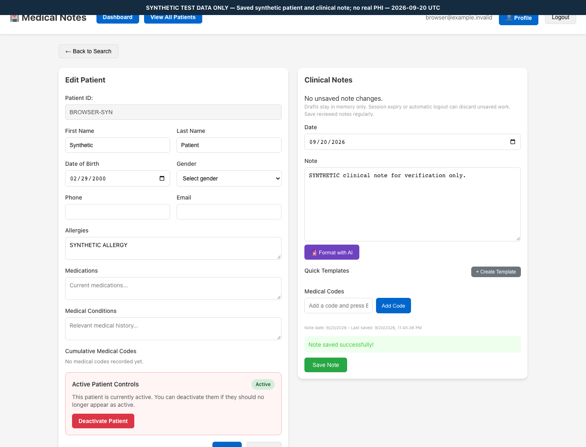
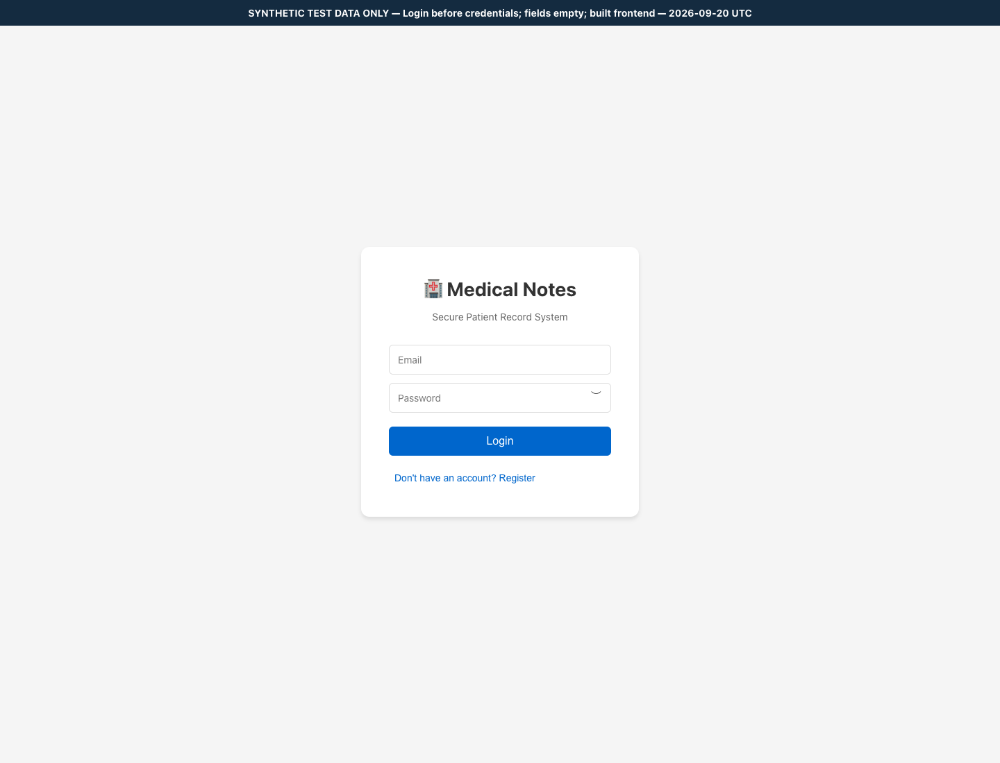
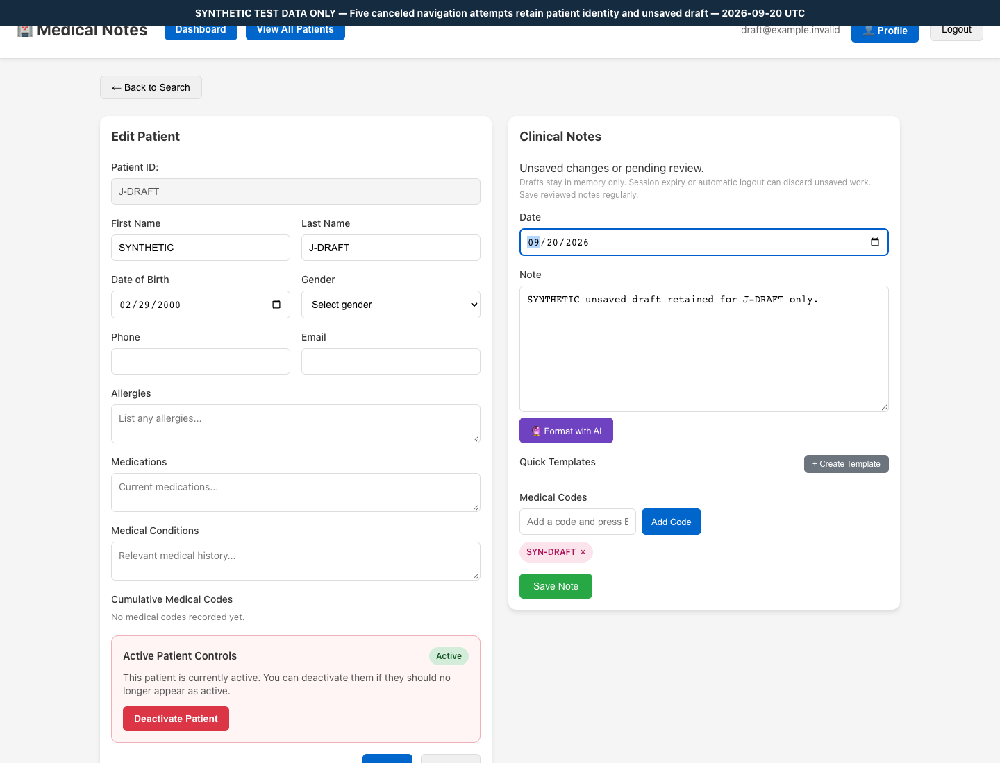
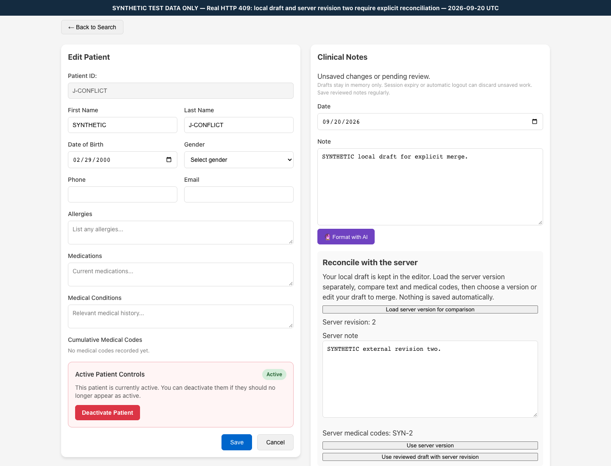
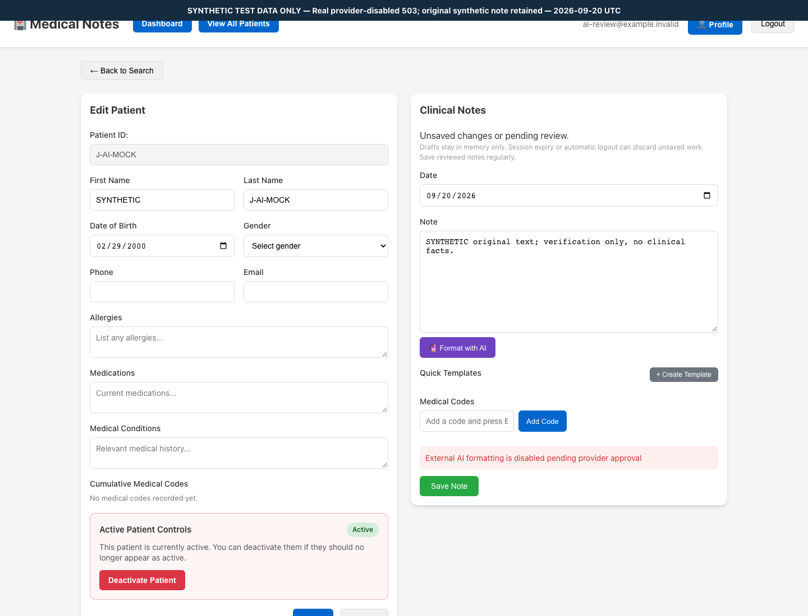
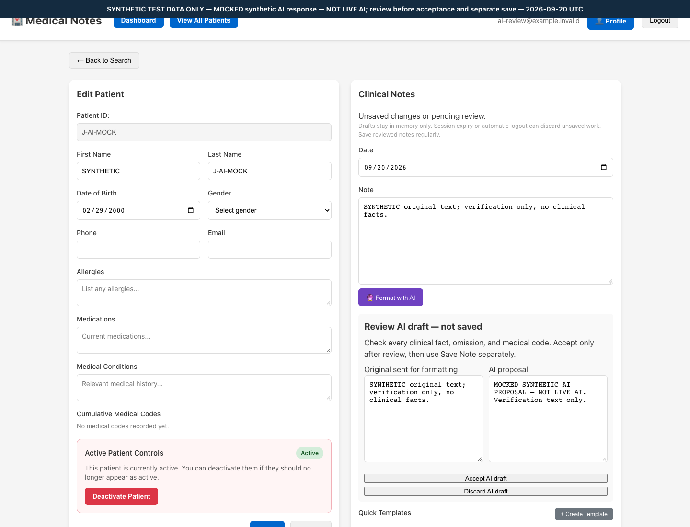
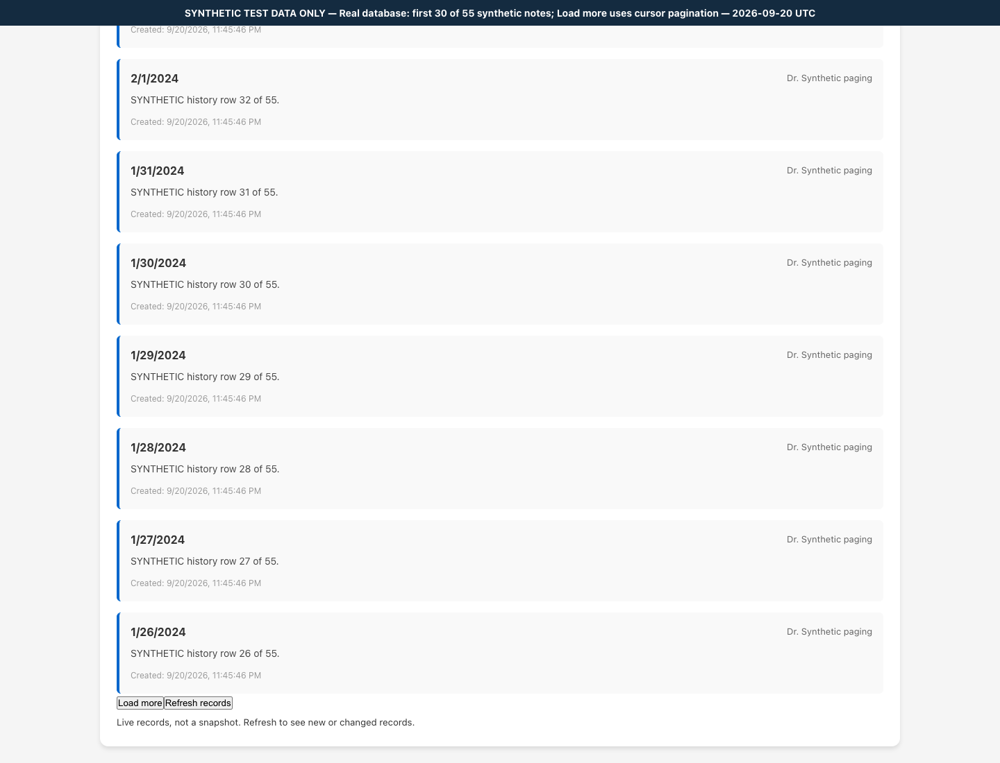
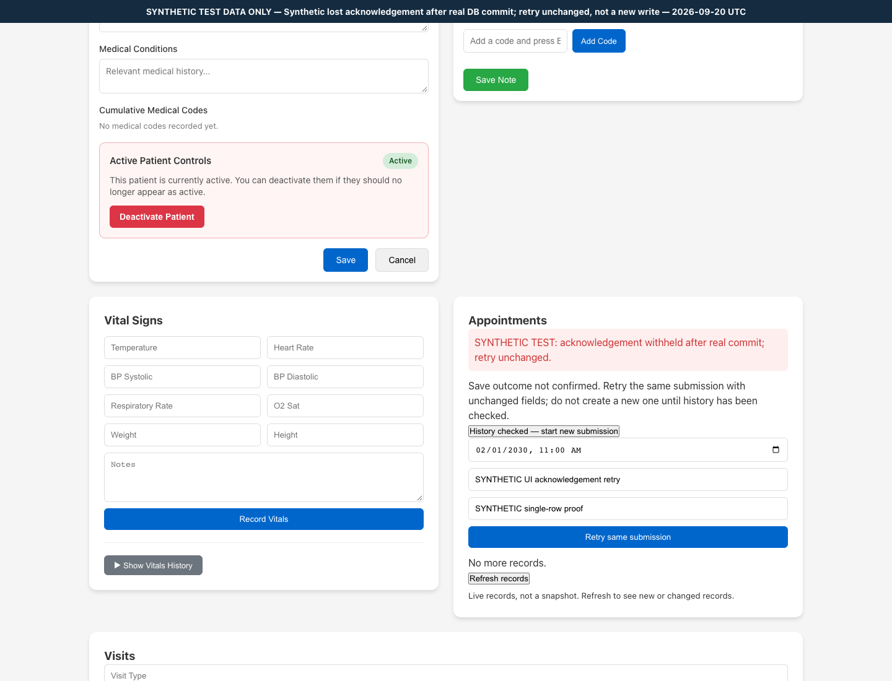

# Synthetic browser evidence — Track J

**SYNTHETIC DATA ONLY. Local verification, not production or clinical/provider certification.**

- Run start (UTC): 2026-09-20T23:45:33.932Z; end (UTC): 2026-09-20T23:45:50.893Z.
- Result: **PASSED**; 8/8 passed; failed 0; timed out 0; skipped 0; interrupted 0; runner errors 0. No automatic retries.
- Node v22.23.2; browser channel installed Chrome (temporary Playwright profile); 1440 × 1100; en-US; UTC browser timezone.
- Built backend and Vite preview, not Vite dev source. Existing VITE_DEV_API_PROXY routes same-origin API requests to the guarded local backend. Each server start creates its own empty schema; initializes and checks exact migrations [1, 2, 3]; normal shutdown drops only that schema.
- API fixtures are synthetic, created through authenticated real HTTP requests (no bulk SQL seeding). API remains at its real 600 requests/minute limit. No deployed service, provider key, production DB, or real PHI is used.
- Invocation: cached Node 22 PATH prefix supplied by the orchestrator; root npm run build (serial), then TEST_DATABASE_URL set to the approved loopback audit fixture, PLAYWRIGHT_CHANNEL=chrome EVIDENCE_SCREENSHOTS=true npm run test:e2e. Default/non-opt-in runs do not change this manifest or PNGs.
- Trace, video, automatic screenshots, persistent auth state, raw console/network logs and automatic retained failure output are disabled. Diagnostics below are counts only; expected failure responses are explicitly allowed per test; all other browser failures fail the test.

## Executed cases

| Case | Status | Duration ms |
|---|---|---:|
| synthetic clinician: register, create patient, save note, record vitals, reload, logout | passed | 3469 |
| invalid credentials do not authenticate or expose response details | passed | 665 |
| canceled draft navigation preserves patient, note date, text and medical codes | passed | 1816 |
| late real patient update response cannot replace another patient with a dirty note | passed | 1263 |
| real note 409 review preserves draft and detects a second external write after comparison | passed | 2036 |
| disabled AI shows helpful error; mocked synthetic proposal requires discard or accept then separate save | passed | 1927 |
| real database paging traverses 55 notes and more than 50 patients without duplicates | passed | 2382 |
| real committed-write retry reuses keys and IDs; private template and appointment actor routes deny access | passed | 2121 |

## Browser diagnostics (counts only)

- synthetic clinician: register, create patient, save note, record vitals, reload, logout: {"pageErrors":0,"unexpectedConsole":0,"expectedConsole":0,"unexpectedHttp":0,"expectedHttp":0,"failedRequests":0,"externalRequests":0}.
- invalid credentials do not authenticate or expose response details: {"pageErrors":0,"unexpectedConsole":0,"expectedConsole":1,"unexpectedHttp":0,"expectedHttp":1,"failedRequests":0,"externalRequests":0}.
- canceled draft navigation preserves patient, note date, text and medical codes: {"pageErrors":0,"unexpectedConsole":0,"expectedConsole":0,"unexpectedHttp":0,"expectedHttp":0,"failedRequests":0,"externalRequests":0}.
- late real patient update response cannot replace another patient with a dirty note: {"pageErrors":0,"unexpectedConsole":0,"expectedConsole":0,"unexpectedHttp":0,"expectedHttp":0,"failedRequests":0,"externalRequests":0}.
- real note 409 review preserves draft and detects a second external write after comparison: {"pageErrors":0,"unexpectedConsole":0,"expectedConsole":2,"unexpectedHttp":0,"expectedHttp":2,"failedRequests":0,"externalRequests":0}.
- disabled AI shows helpful error; mocked synthetic proposal requires discard or accept then separate save: {"pageErrors":0,"unexpectedConsole":0,"expectedConsole":1,"unexpectedHttp":0,"expectedHttp":1,"failedRequests":0,"externalRequests":0}.
- real database paging traverses 55 notes and more than 50 patients without duplicates: {"pageErrors":0,"unexpectedConsole":0,"expectedConsole":0,"unexpectedHttp":0,"expectedHttp":0,"failedRequests":0,"externalRequests":0}.
- real committed-write retry reuses keys and IDs; private template and appointment actor routes deny access: {"pageErrors":0,"unexpectedConsole":0,"expectedConsole":1,"unexpectedHttp":0,"expectedHttp":1,"failedRequests":0,"externalRequests":0}.

## Asserted screenshots / run manifest

Each capture follows awaited UI assertions and an empty-password assertion. A test-only visible caption identifies synthetic/mocked content; it is not application functionality. PNGs show UI states only. Backend claims rely on the accompanying real API assertions, not screenshots alone.

### 02-patient-record

- Caption: Saved synthetic patient and clinical note; no real PHI
- UTC: 2026-09-20T23:45:36.817Z; associated case: **passed**.
- PNG SHA-256: 4ef34f885b55b67af5c09f78eeef9ad5a3bc0ec8fc73e558d0d617af08bce05f

### 01-login

- Caption: Login before credentials; fields empty; built frontend
- UTC: 2026-09-20T23:45:38.668Z; associated case: **passed**.
- PNG SHA-256: 495986ac341a0419aedd618be2c4332612977671c6c61b9592f62c5bc68d5588

### 03-draft-retained

- Caption: Five canceled navigation attempts retain patient identity and unsaved draft
- UTC: 2026-09-20T23:45:40.809Z; associated case: **passed**.
- PNG SHA-256: 6347f9c62384c5f2fe8ae2282ecef9d0175daf2d5bdc97579243b0acb284b84e

### 04-conflict-review

- Caption: Real HTTP 409: local draft and server revision two require explicit reconciliation
- UTC: 2026-09-20T23:45:43.915Z; associated case: **passed**.
- PNG SHA-256: 5c43cfc6ab6427e001c8e4222475b510017625e3dd2d1d9ac485b0321e776eba

### 07-helpful-error

- Caption: Real provider-disabled 503; original synthetic note retained
- UTC: 2026-09-20T23:45:45.787Z; associated case: **passed**.
- PNG SHA-256: c2ce8f3b04db283e9264a8eabcb18f364bc6dcd960812a3ee04b80053020d0ae

### 05-ai-mocked-review

- Caption: MOCKED synthetic AI response — NOT LIVE AI; review before acceptance and separate save
- UTC: 2026-09-20T23:45:45.946Z; associated case: **passed**.
- PNG SHA-256: f721158980367004e6decb162482be19a8a2c541779958378e527c3285a54795

### 06-history-load-more

- Caption: Real database: first 30 of 55 synthetic notes; Load more uses cursor pagination
- UTC: 2026-09-20T23:45:48.364Z; associated case: **passed**.
- PNG SHA-256: 7fc9a16c4f053653b042c5cfe1ee1591f91af3dceec5cd13d64d5817b5d92014

### 08-idempotent-retry

- Caption: Synthetic lost acknowledgement after real DB commit; retry unchanged, not a new write
- UTC: 2026-09-20T23:45:50.547Z; associated case: **passed**.
- PNG SHA-256: 6be9e600b425bb003c69357d8c5dfd757bcf16b7548947f018be333f9d024929

## Artifact/source fingerprints

SHA-256 of sorted [workspace-relative path, file SHA-256] lists (source/build trees, not secret files):

- backend/src: 7d7707974d969bf81b030e37d9952c2f6b801f8a05ed15c403d683276cc21cdb
- frontend/src: 319341f694b5748d3a32e01fe85fc74235bdf984ae21a4a837263c1103af39f7
- backend/dist: 43b91e75070a814920b9997379b0618dbb513b7ad029f4a25de34c1092c12a98
- frontend/dist: 48cd4e930a7e1babb6a02cc8acf94f2e2c4a887a160f4baa9f89329330157319

## Scope and limitations

- AI review uses a browser-intercepted, explicitly labeled synthetic response only. The real disabled-provider endpoint is separately asserted 503. No live AI result, OCR, camera, provider quality or provider approval is claimed.
- The acknowledgement-loss scenario commits a real API write then returns a test-only 503 to the browser. The retry must retain the same key/resource ID and leave exactly one history row. It is deterministic fault injection, not a claim to simulate every network failure.
- Delayed patient update uses a real API response withheld by browser interception; no clinical payload is fabricated. Note conflicts use genuine second/third API writes while the editor is stale, including a write after comparison.
- Readiness is real /ready plus harness verification of migrations [1, 2, 3]. This browser gate does not mutate schema/indexes to test unavailable readiness, certify deployed roles, or replace Track E tests.
- Legacy clinical wall timestamps can display a different day/time from the UTC evidence caption (observed on synthetic last-saved/created labels). This is consistent with the documented unresolved legacy wall-time ambiguity; J did not investigate its root cause or change runtime code. Browser UTC does not establish backend/database timezone correctness; see decision 0006.
- Shared-clinic patient/history reads remain intentional. Private-template filtering and appointment-owner mutation denial do not establish tenant/care-team isolation. No immutable note history, audit durability, retention, MFA, cookie/BFF, or live-provider guarantee is claimed.
- Directory and note-history pagination cross real page boundaries with more than 50 synthetic rows; other history surfaces have create/reload assertions but their exhaustive paging matrix remains Track F scope.
- Historical Track D/F intermittent harness failures remain documented in their track reports with unresolved historical causes. A green browser run does not erase them.
- Implementer iteration history (2026-09-20): initial standalone tsc command omitted --types node and failed before browser execution; corrected invocation passed. First full browser run was 7/8: the new direct-retry fixture used non-UUID keys and was correctly rejected by the API. Fixture changed to randomUUID(), not a runtime fix or relaxed assertion. Initial seven cases had zero unexpected browser diagnostics; the final run above supersedes their PNGs.
- Harness self-review: Playwright default termination may bypass schema cleanup; explicit SIGTERM gracefulShutdown was added before final checks. Five pre-existing e2e schemas were observed at that point (including possible early implementer runs); none were deleted because ownership was not durably recorded. The safety runner checks before/after catalog equality for its own subsequent run.
- Final status update, MAIN handoff (2026-09-20 local / 2026-09-21 UTC): **independent J PASS, eight real-browser cases**, with all mocks declared and source unchanged. That evaluator observed the prior capture; it is not relabelled as having created or evaluated the current PNGs. Implementer environments could not spawn nested evaluator tools; MAIN assigned the distinct read-only/testing evaluator. No implementer self-check is presented as independent acceptance.
- **MAIN independent recapture PASS, 8/8**: the actual run/timestamps/captions/hashes above are MAIN's recapture, not a pending J template. Its retained safety proof confirms zero unexpected console/HTTP events, external requests, failed requests and page errors; unchanged schema catalog and **120 protected files**; all **eight PNG hashes/dimensions valid**. Proof log: `/tmp/medapp-orchestrator-browser-proof-20260920.log`; SHA-256 `5280c0a12c62d35cc916b87f9f58981dfc929d1cce60a501afe7777499727f78`. This documentation update does not regenerate images, alter manifest/hash rows or change source/build fingerprints.
- Current acceptance and remaining blocks are in [FINAL_VERIFICATION.md](FINAL_VERIFICATION.md). Direct proof: [real conflict review](screenshots/04-conflict-review.png), [explicitly MOCKED AI review](screenshots/05-ai-mocked-review.png), [real paged history](screenshots/06-history-load-more.png). **History-secret gate FAIL and Q1–Q7 remain blocked**. In particular, the observed legacy timestamp display ambiguity/high-clinical-use gate is still Q6, not fixed by browser success. No real AI/real PHI or production approval is claimed.
